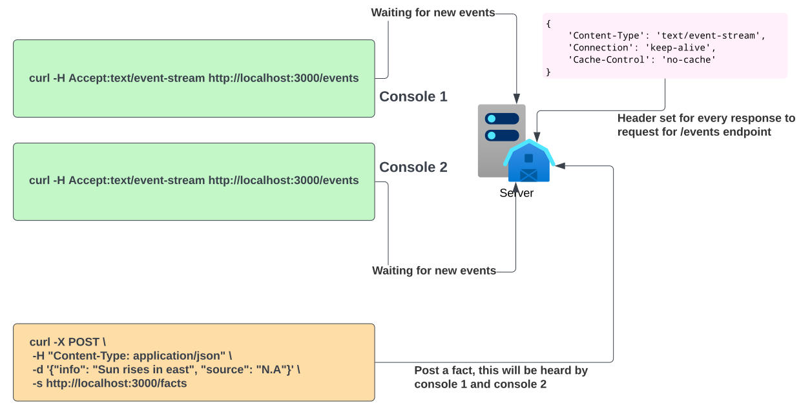

# nodejs-server-sent-events

[](https://sonarcloud.io/summary/new_code?id=ankurksoni_nodejs-server-sent-events)

An app with Node.js engine, express.js, and server-sent events.

## Subscribers

* Open multiple consoles and run the below command,
    ```bash
    curl -H Accept:text/event-stream http://localhost:3000/events
    ```
* All these requests are waiting for any input to be sent from the server.

## Setup

* To start the docker container, run the below command `docker-compose down; docker rmi $(docker images -f "dangling=true" -q); docker system prune; docker-compose up --build -d`

* To stop the docker container, run `docker-compose down`

## Producers

* open a single tab and run the below command,
    ```bash
    curl -X POST \
    -H "Content-Type: application/json" \
    -d '{"info": "Some info", "source": "Some source"}'\
    -s http://localhost:3000/facts
    ```
* Make sure the above subscribers are ready and listening.
* Upon firing the above command, the other subscriber console will get this data.

## Queries
* To get the no. of clients connected to the server, use the below command,
    ```bash
    curl -X GET http://localhost:3000/status
    ```
* To get the facts sent to the server, use below command,
    ```bash
    curl -X GET http://localhost:3000/facts
    ```

## Project in nutshell

